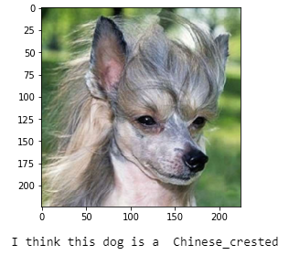
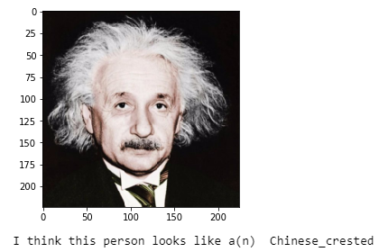

These exercises were cloned from this [Udacity github location](https://github.com/udacity/dog-project). 

## Method

The project runs through the following steps:
1. Import datasets for pictures of human faces and of dogs of various kinds.
1. Detect and extract faces from the human pictures using a Haar Cascade.
1. Detect dogs using a ResNet50 model pretrained on ImageNet data, which is available in keras.
1. Create a CNN to classify dog breeds from scratch using keras functions.
1. Now use a pretrained CNN to classify dog breeds using transfer learning from the VGG-16 model.
1. Pick a different pretrained CNN to classify dog breeds using transfer learning. I picked the VGG-19 model.
1. Write an algorithm for a draft application that receives an input image, determines whether a dog or a human face is present, and then classify the picture according to what dog the picture most resembles.
1. Test the algorithm - feed multiple images of one's own choosing to test how the algorithm performs.

## Results

Below are two pictures, one of a celebrity, and another of a dog, and the output of the network in terms of what dog breed is resembled in those pictures. Additional such pictures along with their network classifications can be found in [this notebook](dog_app.ipynb).

